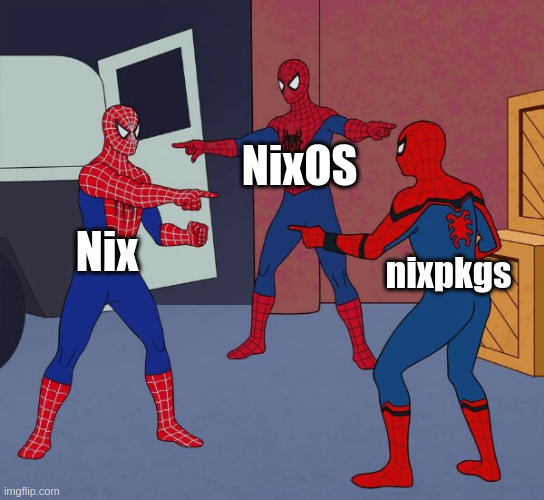

# **Introduction to Nix**

Nix, the declarative approach

https://nixos.org/

---



---

# **Nix is a package manager**

- A purely functional package manager.
- Can be installed on any Linux systemd based system (Ubuntu, macOS, WSL2..)
- Has 100 000+ packages.
- Atomic.
- Reproducible.

---

## **Nix installation**

```bash
sh <(curl -L https://nixos.org/nix/install) --daemon
```

Once installed, one can **temporarly** install a package using:  

```bash
nix-shell -p cmatrix
```

---


---

## **Atomicity**

```
/nix/store/b6gvzjyb2pg0kjfwrjmg1vfhh54ad73z-firefox-33.1/
```


